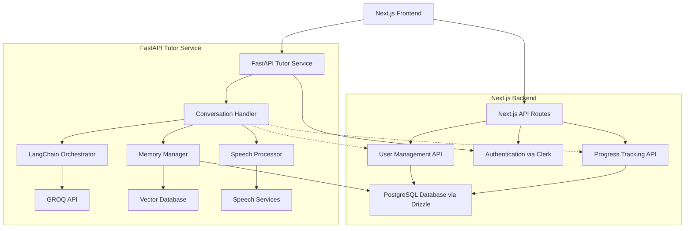

# Design Document

## Overview

The Croatian Tutor Service is a FastAPI-based backend service that integrates with an existing Next.js application to provide AI-powered Croatian language tutoring. The service leverages GROQ's large language models through LangChain, maintains user data in the existing PostgreSQL database, and supports both text and voice interactions for comprehensive language learning.

## Architecture

### High-Level Architecture



### Service Architecture Layers

1. **Next.js API Layer**: Existing user management, authentication, and progress tracking
2. **FastAPI Service Layer**: Specialized Croatian tutoring logic and conversation handling
3. **Shared Data Layer**: PostgreSQL accessed via Drizzle ORM from both services
4. **External Services Layer**: GROQ API, speech services, and vector database

## Components and Interfaces

### 1. FastAPI Application Structure

```python
# FastAPI Tutor Service Structure
tutor_service/
├── main.py                 # FastAPI application entry point
├── routers/
│   └── conversation.py     # Conversation endpoints only
├── services/
│   ├── tutor_service.py   # Main tutoring logic
│   ├── langchain_service.py # LangChain orchestration
│   ├── memory_service.py  # Memory management
│   └── speech_service.py  # Speech processing
├── models/
│   ├── conversation.py    # Conversation data models
│   └── tutor_models.py    # Tutor-specific models
├── database/
│   ├── connection.py     # PostgreSQL connection via Drizzle-equivalent
│   ├── schema.py         # Shared schema definitions
│   └── repositories/     # Data access layer
└── config/
    └── settings.py       # Configuration management
```

### 2. Integration with Existing Next.js Architecture

The FastAPI service will complement your existing Next.js API routes:

**Next.js Responsibilities (Existing):**

- User authentication and management via Clerk
- User profile and onboarding data
- Progress tracking and analytics
- General application state

**FastAPI Service Responsibilities (New):**

- Real-time conversation handling
- LangChain/GROQ integration
- Speech processing
- Conversation memory management

### 2. Core Service Interfaces

#### TutorService Interface

```python
class TutorService:
    async def process_message(
        self,
        user_id: str,
        message: str,
        message_type: MessageType
    ) -> TutorResponse

    async def process_voice_message(
        self,
        user_id: str,
        audio_data: bytes
    ) -> TutorResponse

    async def get_user_progress(self, user_id: str) -> UserProgress
```

#### LangChainService Interface

```python
class LangChainService:
    async def generate_response(
        self,
        user_context: UserContext,
        message: str
    ) -> str

    async def assess_proficiency(
        self,
        user_responses: List[str]
    ) -> ProficiencyLevel

    async def generate_lesson_content(
        self,
        topic: str,
        level: ProficiencyLevel
    ) -> LessonContent
```

### 3. API Endpoints

#### Conversation Endpoints

- `POST /api/v1/conversation/message` - Send text message
- `POST /api/v1/conversation/voice` - Send voice message
- `GET /api/v1/conversation/history/{user_id}` - Get conversation history
- `DELETE /api/v1/conversation/session/{session_id}` - Clear session

#### Progress Endpoints

- `GET /api/v1/progress/{user_id}` - Get user progress
- `PUT /api/v1/progress/{user_id}/level` - Update proficiency level
- `GET /api/v1/progress/{user_id}/analytics` - Get learning analytics

#### Integration Endpoints

- `GET /api/v1/user/{clerk_id}/context` - Get user context from Next.js API
- `POST /api/v1/progress/update` - Send progress updates to Next.js API

## Database Integration Strategy

### 1. Drizzle ORM in FastAPI

To maintain consistency with your existing Next.js architecture, we'll use a Python equivalent approach to Drizzle ORM. While Drizzle is TypeScript-specific, we can achieve similar benefits using:

**Option 1: SQLAlchemy with Alembic (Recommended)**

- Provides similar ORM capabilities to Drizzle
- Excellent PostgreSQL support
- Type-safe queries with modern Python typing
- Migration management similar to Drizzle Kit

**Option 2: Asyncpg with Raw SQL**

- Direct PostgreSQL async driver
- Maximum performance for conversation handling
- Shared schema definitions with your existing Drizzle schema

**Recommended Approach:**

```python
# database/connection.py
from sqlalchemy.ext.asyncio import create_async_engine, AsyncSession
from sqlalchemy.orm import sessionmaker
import os

DATABASE_URL = os.getenv("DATABASE_URL").replace("postgresql://", "postgresql+asyncpg://")

engine = create_async_engine(DATABASE_URL)
AsyncSessionLocal = sessionmaker(engine, class_=AsyncSession, expire_on_commit=False)

async def get_db():
    async with AsyncSessionLocal() as session:
        yield session
```

### 2. Shared Schema Strategy

We'll create Python equivalents of your existing Drizzle schema to ensure consistency:

```python
# database/schema.py - Python equivalent of your Drizzle schema
from sqlalchemy import Column, Integer, String, Boolean, DateTime, Text, JSON
from sqlalchemy.ext.declarative import declarative_base
from sqlalchemy.sql import func

Base = declarative_base()

class User(Base):
    __tablename__ = "users"

    id = Column(Integer, primary_key=True)
    clerk_id = Column(String, unique=True, nullable=False)
    email = Column(String, unique=True, nullable=False)
    username = Column(String, nullable=True)
    first_name = Column(String, nullable=True)
    last_name = Column(String, nullable=True)
    onboarding_completed = Column(Boolean, default=False)
    onboarding_questions = Column(JSON, nullable=True)  # Contains languageLevel
    created_at = Column(DateTime, server_default=func.now())
    updated_at = Column(DateTime, server_default=func.now(), onupdate=func.now())
```

## Data Models

### 1. Database Schema Extensions

#### Conversation Tables (New)

```sql
-- Conversation sessions
CREATE TABLE conversation_sessions (
    id UUID PRIMARY KEY DEFAULT gen_random_uuid(),
    user_id UUID REFERENCES users(id),
    started_at TIMESTAMP DEFAULT NOW(),
    ended_at TIMESTAMP,
    session_type VARCHAR(50) DEFAULT 'tutoring',
    created_at TIMESTAMP DEFAULT NOW()
);

-- Individual messages
CREATE TABLE conversation_messages (
    id UUID PRIMARY KEY DEFAULT gen_random_uuid(),
    session_id UUID REFERENCES conversation_sessions(id),
    message_type VARCHAR(20) CHECK (message_type IN ('user', 'assistant')),
    content TEXT NOT NULL,
    audio_url VARCHAR(500),
    metadata JSONB,
    created_at TIMESTAMP DEFAULT NOW()
);

-- Learning progress tracking
CREATE TABLE learning_progress (
    id UUID PRIMARY KEY DEFAULT gen_random_uuid(),
    user_id UUID REFERENCES users(id),
    topic VARCHAR(100) NOT NULL,
    proficiency_score DECIMAL(3,2),
    last_practiced TIMESTAMP DEFAULT NOW(),
    practice_count INTEGER DEFAULT 1,
    created_at TIMESTAMP DEFAULT NOW(),
    updated_at TIMESTAMP DEFAULT NOW()
);

-- Vocabulary tracking
CREATE TABLE vocabulary_progress (
    id UUID PRIMARY KEY DEFAULT gen_random_uuid(),
    user_id UUID REFERENCES users(id),
    word VARCHAR(100) NOT NULL,
    definition TEXT,
    proficiency_level INTEGER DEFAULT 1,
    times_practiced INTEGER DEFAULT 0,
    last_seen TIMESTAMP DEFAULT NOW(),
    created_at TIMESTAMP DEFAULT NOW()
);
```

#### Leveraging Existing User Schema

Your existing `onboardingQuestions` JSONB field already contains `languageLevel`, so no schema changes are needed:

```typescript
// Existing structure in your codebase
export type OnboardingQuestions = {
  goal?: string | null;
  languageLevel?: string | null; // This is what we'll use!
  commitment?: string | null;
};
```

The FastAPI service will read the `languageLevel` from `onboardingQuestions.languageLevel` to determine user proficiency.

### 2. Application Data Models

#### Core Models

```python
from pydantic import BaseModel
from enum import Enum
from typing import Optional, List
from datetime import datetime

class ProficiencyLevel(str, Enum):
    BEGINNER = "beginner"
    ELEMENTARY = "elementary"
    INTERMEDIATE = "intermediate"
    UPPER_INTERMEDIATE = "upper_intermediate"
    ADVANCED = "advanced"

class MessageType(str, Enum):
    TEXT = "text"
    VOICE = "voice"
    IMAGE = "image"

class ConversationMessage(BaseModel):
    id: str
    session_id: str
    message_type: MessageType
    content: str
    audio_url: Optional[str] = None
    metadata: Optional[dict] = None
    created_at: datetime

class UserContext(BaseModel):
    user_id: str
    proficiency_level: ProficiencyLevel
    conversation_history: List[ConversationMessage]
    learning_preferences: dict
    current_topics: List[str]

class TutorResponse(BaseModel):
    text_response: str
    audio_url: Optional[str] = None
    suggestions: List[str] = []
    corrections: List[dict] = []
    vocabulary_introduced: List[dict] = []
```

## LangChain Integration Architecture

### 1. LangChain Components

#### Chain Configuration

```python
from langchain.chains import ConversationChain
from langchain.memory import ConversationBufferWindowMemory
from langchain.prompts import PromptTemplate
from langchain_groq import ChatGroq

class CroatianTutorChain:
    def __init__(self):
        self.llm = ChatGroq(
            model="llama3-70b-8192",
            temperature=0.7,
            groq_api_key=settings.GROQ_API_KEY
        )

        self.memory = ConversationBufferWindowMemory(
            k=10,  # Keep last 10 exchanges
            return_messages=True
        )

        self.prompt = self._create_tutor_prompt()

    def _create_tutor_prompt(self) -> PromptTemplate:
        template = """
        You are Marija, a friendly and patient Croatian language tutor.

        Student Profile:
        - Proficiency Level: {proficiency_level}
        - Learning Goals: {learning_goals}
        - Recent Topics: {recent_topics}

        Guidelines:
        1. Adapt your Croatian complexity to the student's level
        2. Provide gentle corrections when needed
        3. Introduce new vocabulary contextually
        4. Include cultural context when relevant
        5. Encourage practice and provide positive feedback

        Current conversation:
        {history}

        Student: {input}
        Marija:"""

        return PromptTemplate(
            input_variables=["proficiency_level", "learning_goals", "recent_topics", "history", "input"],
            template=template
        )
```

### 2. Memory Management Strategy

#### Vector Database Integration

```python
from langchain.vectorstores import Chroma
from langchain.embeddings import HuggingFaceEmbeddings

class MemoryService:
    def __init__(self):
        self.embeddings = HuggingFaceEmbeddings(
            model_name="sentence-transformers/all-MiniLM-L6-v2"
        )

        self.vector_store = Chroma(
            collection_name="croatian_tutor_memory",
            embedding_function=self.embeddings,
            persist_directory="./chroma_db"
        )

    async def store_interaction(self, user_id: str, interaction: dict):
        """Store significant learning interactions"""
        document = f"User {user_id}: {interaction['summary']}"
        metadata = {
            "user_id": user_id,
            "timestamp": interaction["timestamp"],
            "topic": interaction["topic"],
            "proficiency_level": interaction["level"]
        }

        self.vector_store.add_texts([document], metadatas=[metadata])

    async def retrieve_relevant_context(self, user_id: str, query: str, k: int = 3):
        """Retrieve relevant past interactions"""
        results = self.vector_store.similarity_search(
            query,
            k=k,
            filter={"user_id": user_id}
        )
        return results
```

## Speech Processing Integration

### 1. Speech-to-Text Service

```python
import speech_recognition as sr
from pydub import AudioSegment

class SpeechService:
    def __init__(self):
        self.recognizer = sr.Recognizer()

    async def transcribe_audio(self, audio_data: bytes) -> str:
        """Convert Croatian speech to text"""
        try:
            # Convert audio data to format suitable for recognition
            audio = AudioSegment.from_file(io.BytesIO(audio_data))
            audio = audio.set_frame_rate(16000).set_channels(1)

            # Use Google Speech Recognition with Croatian language
            with sr.AudioFile(io.BytesIO(audio.export(format="wav").read())) as source:
                audio_data = self.recognizer.record(source)
                text = self.recognizer.recognize_google(
                    audio_data,
                    language="hr-HR"  # Croatian language code
                )
                return text
        except Exception as e:
            raise SpeechProcessingError(f"Failed to transcribe audio: {str(e)}")
```

### 2. Text-to-Speech Service

```python
from gtts import gTTS
import io

class TextToSpeechService:
    async def generate_speech(self, text: str) -> bytes:
        """Convert Croatian text to speech"""
        try:
            tts = gTTS(text=text, lang='hr', slow=False)
            audio_buffer = io.BytesIO()
            tts.write_to_fp(audio_buffer)
            audio_buffer.seek(0)
            return audio_buffer.read()
        except Exception as e:
            raise SpeechProcessingError(f"Failed to generate speech: {str(e)}")
```

## Error Handling

### 1. Custom Exception Classes

```python
class TutorServiceError(Exception):
    """Base exception for tutor service"""
    pass

class GroqAPIError(TutorServiceError):
    """GROQ API related errors"""
    pass

class SpeechProcessingError(TutorServiceError):
    """Speech processing related errors"""
    pass

class DatabaseError(TutorServiceError):
    """Database operation errors"""
    pass
```

### 2. Error Handling Strategy

- **API Errors**: Graceful degradation with fallback responses
- **Database Errors**: Retry logic with exponential backoff
- **Speech Errors**: Fallback to text-only interaction
- **GROQ API Limits**: Queue management and rate limiting

## Testing Strategy

### 1. Unit Testing

- **Service Layer**: Mock external dependencies (GROQ, database)
- **LangChain Integration**: Test prompt engineering and response quality
- **Speech Processing**: Test with sample Croatian audio files
- **Database Operations**: Test with in-memory database

### 2. Integration Testing

- **End-to-End Conversation Flow**: Test complete user journey
- **API Endpoint Testing**: Test all REST endpoints
- **Database Integration**: Test with actual PostgreSQL instance
- **External Service Integration**: Test GROQ API integration

### 3. Performance Testing

- **Concurrent Users**: Test multiple simultaneous conversations
- **Response Time**: Ensure sub-2-second response times
- **Memory Usage**: Monitor vector database performance
- **API Rate Limits**: Test GROQ API rate limiting

### 4. Croatian Language Testing

- **Accuracy Testing**: Validate Croatian grammar and vocabulary
- **Cultural Context**: Test cultural appropriateness of responses
- **Proficiency Adaptation**: Test response complexity adaptation
- **Speech Recognition**: Test Croatian speech recognition accuracy

## Security Considerations

### 1. Authentication & Authorization Strategy

**Integration with Existing Clerk Authentication:**

```python
# FastAPI service will validate Clerk JWT tokens
from clerk_backend_api import Clerk

async def verify_clerk_token(authorization: str):
    """Verify Clerk JWT token and return user info"""
    try:
        token = authorization.replace("Bearer ", "")
        clerk = Clerk(bearer_auth=os.getenv("CLERK_SECRET_KEY"))

        # Verify the token with Clerk
        session = clerk.sessions.verify_session(token)
        return session.user_id
    except Exception:
        raise HTTPException(status_code=401, detail="Invalid token")

# Usage in FastAPI endpoints
@app.post("/api/v1/conversation/message")
async def send_message(
    message: ConversationMessage,
    clerk_user_id: str = Depends(verify_clerk_token)
):
    # Use clerk_user_id to fetch user context from your existing API
    pass
```

**User Context Retrieval:**

- FastAPI service calls your existing Next.js API to get user data
- Leverages existing `/api/user` endpoint you already have
- Maintains single source of truth for user data
- Rate limiting per authenticated user

### 2. Data Protection

- Encrypt sensitive user data at rest
- Secure API key management
- Audio data encryption and secure storage
- GDPR compliance for EU users

### 3. API Security

- Input validation and sanitization
- SQL injection prevention
- XSS protection
- CORS configuration

## Deployment Architecture

### 1. Infrastructure Components

- **FastAPI Service**: Containerized with Docker
- **PostgreSQL**: Existing database instance
- **Vector Database**: Chroma or Qdrant deployment
- **File Storage**: For audio files (S3 or local storage)
- **Load Balancer**: For high availability

### 2. Environment Configuration

- Development: Local PostgreSQL, local vector DB
- Staging: Shared PostgreSQL, cloud vector DB
- Production: Production PostgreSQL, scalable vector DB

### 3. Monitoring & Logging

- Application metrics (response times, error rates)
- Database performance monitoring
- GROQ API usage tracking
- User interaction analytics
