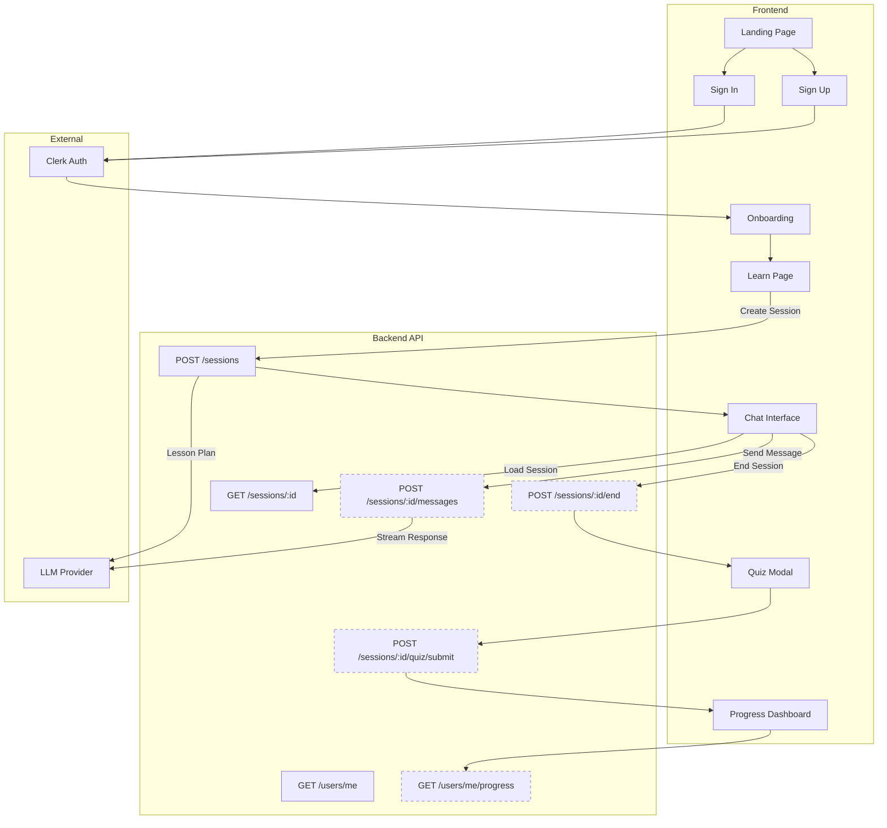

# Hrvatsk-AI Frontend Prototype Plan

## Overview

This plan outlines the Next.js 15 frontend prototype for Hrvatsk-AI, a conversational Croatian language learning app. The prototype will be polished using shadcn/ui and connect to the existing sessions API.

## Tech Stack

| Technology     | Purpose                                                    |
| -------------- | ---------------------------------------------------------- |
| Next.js 15     | App Router, Server Components, React 19                    |
| TypeScript     | Type safety throughout                                     |
| Tailwind CSS   | Styling foundation                                         |
| shadcn/ui      | Pre-built accessible components                            |
| Clerk          | Authentication (pre-built components, user metadata store) |
| Tanstack Query | Server state management, API calls                         |

### Why Next.js 15?

- Cleaner caching model (explicit opt-in vs automatic)
- React 19 support with new hooks (`use`, `useOptimistic`)
- Stable Turbopack for faster development
- No reason to start a new project on an older version

## Project Structure

```
hrvatsk-ai-web/
├── src/
│   ├── app/
│   │   ├── layout.tsx              # Root layout with ClerkProvider
│   │   ├── page.tsx                # Landing page
│   │   ├── sign-in/[[...sign-in]]/page.tsx
│   │   ├── sign-up/[[...sign-up]]/page.tsx
│   │   ├── onboarding/
│   │   │   └── page.tsx            # Level selection + preferences
│   │   ├── learn/
│   │   │   ├── page.tsx            # Session list / start new
│   │   │   └── [sessionId]/page.tsx# Chat interface
│   │   └── progress/
│   │       └── page.tsx            # Dashboard (mock data initially)
│   ├── components/
│   │   ├── ui/                     # shadcn/ui components
│   │   ├── layout/
│   │   │   ├── header.tsx
│   │   │   ├── sidebar.tsx
│   │   │   └── footer.tsx
│   │   ├── chat/
│   │   │   ├── chat-container.tsx
│   │   │   ├── message-bubble.tsx
│   │   │   ├── chat-input.tsx
│   │   │   └── typing-indicator.tsx
│   │   ├── quiz/
│   │   │   ├── quiz-modal.tsx
│   │   │   └── question-card.tsx
│   │   ├── session/
│   │   │   ├── session-card.tsx
│   │   │   ├── lesson-plan-display.tsx
│   │   │   └── objectives-tracker.tsx
│   │   └── onboarding/
│   │       ├── level-selector.tsx
│   │       └── preferences-form.tsx
│   ├── lib/
│   │   ├── api/
│   │   │   ├── client.ts           # Fetch wrapper with auth
│   │   │   ├── sessions.ts         # Session API calls
│   │   │   └── types.ts            # API response types
│   │   └── utils.ts
│   └── hooks/
│       ├── use-session.ts
│       └── use-chat.ts
├── middleware.ts                    # Clerk auth middleware
└── next.config.ts
```

## Page Breakdown

### 1. Landing Page (`/`)

**Purpose:** Marketing page, conversion to sign-up

**Components:**

- Hero section with value proposition
- Feature highlights (conversational learning, adaptive lessons, Croatian-specific)
- CTA buttons to sign-up/sign-in

**API Connections:** None (static content)

---

### 2. Auth Pages (`/sign-in`, `/sign-up`)

**Purpose:** Clerk-managed authentication

**Implementation:** Use Clerk's `<SignIn />` and `<SignUp />` components with custom styling to match design system.

---

### 3. Onboarding (`/onboarding`)

**Purpose:** Collect user preferences after first sign-up

**Components:**

- Level selector (A1-B2 with descriptions)
- Native language selector
- Session length preference
- Focus area preferences

**API Connections:**

- **Prototype:** Store in Clerk user metadata via `user.update()`
- **Future:** `PATCH /users/me` when backend endpoint exists

**User Metadata Schema (stored in Clerk):**

```json
{
  "onboarding_completed": true,
  "current_level": "A1",
  "native_language": "en",
  "preferred_session_length": 15,
  "focus_areas": ["vocabulary", "conversation"]
}
```

**Flow:**

```
Sign Up → Clerk creates user → Redirect to /onboarding →
  Save preferences to Clerk metadata → Redirect to /learn
```

**Tech Debt:** When `/users/me` backend endpoints are ready, sync Clerk metadata to the database on first API call and use backend as source of truth thereafter.

---

### 4. Learn Page (`/learn`)

**Purpose:** Session list and start new session

**Components:**

- New Session button (opens modal/form)
- Session configuration: time allocation, focus preference
- Recent sessions list (when API supports it)

**API Connections:**

- `POST /api/v1/sessions` - Create new session
- `GET /api/v1/sessions/:id` - Fetch session details

---

### 5. Chat Interface (`/learn/[sessionId]`)

**Purpose:** Main conversational learning interface

**Components:**

- Chat container with message history
- Message bubbles (user/assistant styles)
- Chat input with send button
- Lesson plan sidebar (collapsible)
- Objectives progress tracker
- Session timer
- End session button

**API Connections:**

- `GET /api/v1/sessions/:id` - Load session + lesson plan
- `POST /api/v1/sessions/:id/messages` (future) - Send message, receive SSE stream
- `POST /api/v1/sessions/:id/end` (future) - End session, trigger quiz

**Note:** Chat messaging not yet implemented in API. For prototype:

- Display lesson plan from session
- Mock chat interface with static conversation
- Prepare SSE streaming code for when API is ready

---

### 6. Quiz Modal

**Purpose:** End-of-session assessment

**Components:**

- Modal overlay
- Question card (multiple types: translate, fill-blank, multiple-choice)
- Progress indicator
- Submit button
- Results display

**API Connections:**

- Future: `POST /api/v1/sessions/:id/quiz/submit`

**Note:** Quiz generation not yet in API. Build UI with mock data.

---

### 7. Progress Dashboard (`/progress`)

**Purpose:** Learning statistics and achievements

**Components:**

- Stats cards (streak, vocabulary count, study minutes)
- Weekly activity chart
- Vocabulary by level breakdown
- Recent achievements

**API Connections:**

- Future: `GET /api/v1/users/me/progress`

**Note:** Progress API not yet implemented. Build UI with mock data.

---

## Implementation Phases

### Phase 1: Project Setup & Layout

- [ ] Initialize Next.js 15 project with TypeScript
- [ ] Set up Tailwind CSS
- [ ] Install and configure shadcn/ui
- [ ] Set up Clerk (install, environment variables, middleware)
- [ ] Create root layout with ClerkProvider
- [ ] Build header component with navigation and UserButton
- [ ] Build footer component
- [ ] Create base page layouts

### Phase 2: Authentication Flow

- [ ] Create sign-in page with Clerk SignIn component
- [ ] Create sign-up page with Clerk SignUp component
- [ ] Configure Clerk redirects (after sign-in → /learn, after sign-up → /onboarding)
- [ ] Test auth flow end-to-end

### Phase 3: Landing Page

- [ ] Build hero section
- [ ] Build feature highlights section
- [ ] Add navigation CTAs
- [ ] Mobile responsive design

### Phase 4: Onboarding

- [ ] Build level selector component with CEFR descriptions
- [ ] Build preferences form
- [ ] Store preferences in Clerk user metadata (publicMetadata)
- [ ] Mark onboarding_completed in metadata
- [ ] Redirect to /learn on completion

### Phase 5: API Integration Layer

- [ ] Create API client with Clerk token injection
- [ ] Define TypeScript types matching API contract
- [ ] Create sessions API functions
- [ ] Set up Tanstack Query provider and hooks

### Phase 6: Learn Page & Session Creation

- [ ] Build learn page layout
- [ ] Build new session form/modal
- [ ] Integrate POST /sessions API
- [ ] Handle loading/error states
- [ ] Redirect to chat page on session creation

### Phase 7: Chat Interface

- [ ] Build chat container layout
- [ ] Build message bubble components
- [ ] Build chat input component
- [ ] Build lesson plan sidebar
- [ ] Build objectives tracker
- [ ] Integrate GET /sessions/:id for lesson plan display
- [ ] Add mock conversation for demonstration
- [ ] Prepare SSE streaming infrastructure

### Phase 8: Quiz UI (Mock)

- [ ] Build quiz modal component
- [ ] Build question card for each type
- [ ] Build results display
- [ ] Wire up with mock quiz data from lesson plan

### Phase 9: Progress Dashboard (Mock)

- [ ] Build stats cards
- [ ] Build activity chart (use recharts or similar)
- [ ] Build vocabulary breakdown
- [ ] Populate with realistic mock data

### Phase 10: Polish & Testing

- [ ] Responsive design audit (mobile, tablet, desktop)
- [ ] Accessibility audit (keyboard nav, screen readers)
- [ ] Loading states and skeletons
- [ ] Error boundaries
- [ ] Test all user flows

---

## Data Flow Diagram



_Dashed lines indicate APIs not yet implemented_

---

## Mock Data Strategy

Until backend APIs are ready, the frontend will use mock data:

| Feature         | Mock Strategy                       |
| --------------- | ----------------------------------- |
| User profile    | Clerk user `publicMetadata`         |
| Session history | localStorage                        |
| Chat messages   | Static array matching API schema    |
| Quiz questions  | Extract from lesson plan vocabulary |
| Progress stats  | Hardcoded realistic values          |

Mock data files will live in `src/lib/mocks/` and can be swapped for real API calls incrementally.

---

## Environment Variables

```bash
# Clerk
NEXT_PUBLIC_CLERK_PUBLISHABLE_KEY=pk_test_...
CLERK_SECRET_KEY=sk_test_...
NEXT_PUBLIC_CLERK_SIGN_IN_URL=/sign-in
NEXT_PUBLIC_CLERK_SIGN_UP_URL=/sign-up
NEXT_PUBLIC_CLERK_AFTER_SIGN_IN_URL=/learn
NEXT_PUBLIC_CLERK_AFTER_SIGN_UP_URL=/onboarding

# API
NEXT_PUBLIC_API_URL=http://localhost:8000/api/v1
```

---

## Decisions Made

| Question          | Decision                                                   |
| ----------------- | ---------------------------------------------------------- |
| Next.js version   | **15** - cleaner caching, React 19, no reason to start old |
| User data storage | **Clerk publicMetadata** until `/users/me` endpoint exists |
| UI language       | **English-only** for prototype                             |

## Remaining Open Questions

1. **Clerk app creation**: Do you have a Clerk account set up, or should I include setup steps?

2. **Styling theme**: Any preference for color palette? Default will be a clean blue/gray scheme.

3. **Session persistence**: When a user refreshes during a chat session, should we restore the conversation? (Depends on messages API - for prototype, session will reset on refresh)
